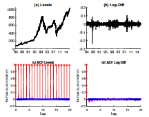
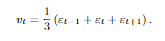
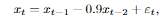

# Introduction to Time Series Analysis

## Real Life Examples

The first step in any time series investigation always involves careful scrutiny of the recordeddata plotted over time

### Johnson & Johnson


This picture shows quarterly earnings per share for the U.S. company Johnson&Johnson.

In this case we want to focus our attention on the __increasing underlying trend variability__, and somewhat __regular oscillation__ superimposed on the trend that seems to repeat over quarters.

```R
library(astsa)
tsplot(jj, type="o", ylab="Quarterly  Earnings  per  Share")
tsplot(log(jj)) # not  shown
```

### S&P100 Index



This picture shows prices and daily returns of the Standard and Poor’s 100 Index (S&P100) from 1984 to 2017

It is easy to spot the financial crisis of 2008 in the figure

The mean of the series appears to be stable with an average return of apporximately zero, however, the __volatility__ (or __variability__) of data __exhibits clustering__; that is __highly volative periods tend to be clustered together__

```R
library(xts)
djiar = diff(log(djia$Close))[-1] # approximate  returns
tsplot(djiar , main="DJIA  Returns", xlab=’’, margins=.5)
```

### USD/GBP Foreign exchange rate


This image shows the weekly USD/GBP foreign exchange rate (U.S. Dollars to One British Pound)

```R
library("fImport")
usbp=fredSeries("DEXUSEU", from="2001-01-01")
tsplot(usbp)
```

### Crypto currencies


This image shows Cryptocurrency “BitCoin” from April 28, 2013 to November 25, 2017

## Time series methods

The primary objective of time series analysis is to develop mathematical models that provide plausible descriptions for sample data

### White noise

A simple kind of generated series might be a collection of uncorrelated random variables, _wt_, with __mean 0__ and __finite variance σ^2__. We denote this process as __ε_t ~ N(0,σ^2)__

The time series generated from uncorrelated variables is used as a model for noise in engineering applications where it is called white noise

We often require stronger conditions and need the noise to be __Gaussian white noise__, where in the ε_t are independent and identically distributed (iid) normal random variables, with __mean 0__ and __variance σ^2__

Although both cases require __0 mean__ and __constant variance__, the difference is that generically, the term white noise means the time series is uncorrelated. __Gaussian white noise__ implies __normality__ (which implies __independence__)

If the stochastic behaviour of all time series could be explained in terms of the __white noise model__, classical statistical methods would suffice.

### Moving averages and filters

We might __replace__ the __white noise series wt__ __by__ a __moving average__ that __smooths the series__

e.g.



```R
w = rnorm (500,0,1) # 500 N(0,1)  variates
v = filter(w, sides=2, rep (1/3 ,3)) # moving  average
par(mfrow=c(2,1))
tsplot(w, main="white  noise")
tsplot(v, ylim=c(-3,3), main="moving  average")
```

This series is much smoother than the white noise series, and it is apparent that averaging removes some of the high frequency behaviour of the noise.

A linear combination of values in a time series such as the above equation is referred to, generically, a filtered series; hence the command filter.

### Autoregressions

Suppose we consider the __white noise series ε_t__ as input and calculate the output using the __second order equation__



Successively for t = 1,2... the previous equation represents a __regression or prediction__ fo the current value __x_t__ of a time series as a __function of the past two values__ of the series, and, hence, the term autoregression is suggested for this model.

A problem with startup values exists here because the equation also depends on the initial conditions x_0 and x_-1, but for now assume they are 0. We can then generate data recursively by substituting into the previuos formula

```R
w = rnorm (550,0,1) # 50  extra  to  avoid  startup  problems
x = filter(w, filter=c(1,-.9), method="recursive")[-(1:50)]
tsplot(x, main="autoregression")
```

### Random walk with drift